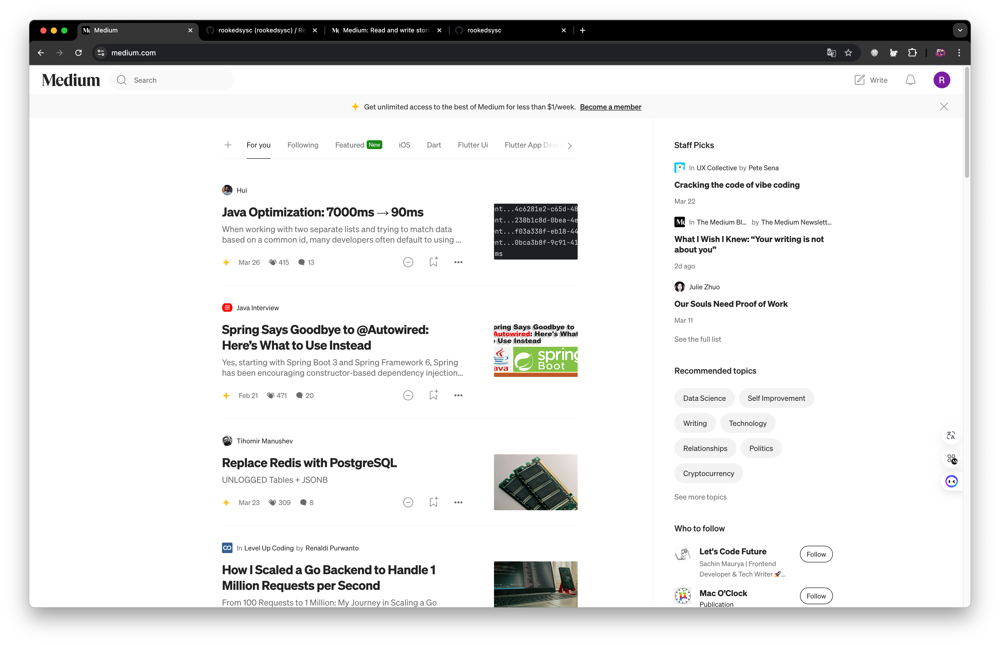

## Introduce

React 학습을 위한 Medium Clone Project

## Frontend

- lang: TypeScript, React,
- route: Tanstack-Router,
- state: Tanstack-Query, Zustand,
- style: Vanilla Extract,
- lint: ESLint, Prettier, commitlint, lint-staged, lefthook
- CI/CD: test, build, deploy(Vercel/CloudFlares Pages / or 직접하면 AWS CloudFront)

## Backend

- lang: Kotlin
- framework: Spring Boot
- database: MySQL
- ORM: JPA

## Requirements

- 시작 페이지

- login 페이지 / 회원 가입 페이지

  
  

- 메인 페이지

- 상세 페이지

    
    

- 게시물 작성 페이지

    
    

